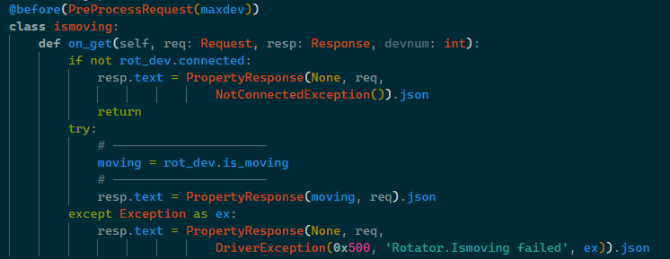

.. image:: alpaca128.png
    :height: 92px
    :width: 128px
    :align: right

=================
Developer Roadmap
=================

It's suggested that you make an Alpaca driver for a single ASCOM device type and
a single instance of that device, using the sample Rotator driver as a guide.
Before doing this, though, it's good to know how the moving parts fit together.
This roadmap is written with that in mind.

.. note::
    If you are more inclined to dive in and sink or swim, follow the steps in
    :ref:`create-first_driver` then when you get mixed up, don't know what's
    what, you can come back here and take the time to come up to speed on the
    structure and usage of the moving parts.

.. _logging_support:

Logging Support
---------------

The boilerplate logic includes an app-wide logging function. See :doc:`log`
for details. Calls to ``logger.info()``, ``logger.debug()``,
etc., write to a file ``alpaca.log``. See |loghowto|.

**Logging Level**

Normally, the logger will log at level INFO. This means ``info`` and higher
messages will be logged, and ``debug`` ones will not. See |loghowto|. To change
the logging level, edit ``config.toml`` at ``log_level``. Note that ``config.py``
converts the text level name (e.g. ``INFO``) to the numeric value needed. So
you can use ``INFO``, ``DEBUG``, ``WARNING``, etc.

**Rotation of Logs**

Each time the app is started, the existing ``alpaca.log`` is renamed
``alpaca.log.1``. Next ime that one will be renamed ``alpaca.log.2`` and the
``alpaca.log`` will  be renamed ``alpaca.log.1`` with the newest log being
``alpaca.log``. The logger will kee up to 10 generations, but you can change
this in ``config.toml`` as ``num_keep_logs``. Logs will be rotated if the size
exceeeds 5MB, but you can change this in ``config.toml`` as ``max_size_mb``.

**Logging to the Console**

The logger normally writes only to ``alpaca.log`` since a device driver will
not normally run with an interactive console. However for debugging purposes,
you may wish to have it log to the console (stdout) as well as the file.
This is set in ``config.toml`` as ``log_to_stdout``.

Alpaca Driver Request Flow - Responder Classes
----------------------------------------------

Incoming HTTP/REST requests from the client are routed through the server by
Falcon, and result in calls to the *responder* classes for the device API. For
example, an app would send the following HTTP request to see if the rotator is
moving:

``/api/v1/rotator/0/ismoving?ClientID=xxx&ClientTransactionID=yyy``

Here is the code to handle a simple request for the Rotator's
:py:class:`~rotator.IsMoving` property.

Preprocessor
~~~~~~~~~~~~

``@before`` - This is a decorator :py:class:`~shr.PreProcessRequest()` which is
applied to all responder classes. TIts job is to quality check the request. It
rejects illegal values for Alpaca ``ClientID`` and ``ClientTransactionID``. It
also checks that the ``DeviceNumber`` in the request is a valid integer, and in range for the
maximum device number (0  by default). If any of these tests fail, it raises an ``HTTPBadRequest``
[#f1]_  with a body containing a specific error message.

If your driver supports multiple instances of your device (e.g. multiple focusers)
then the ``maxdev`` variable in your device responder code (e.g. focuser.py) will
need to be one less than the number of instances you support.

.. note::

    Raising an ``HTTPBadRequest`` [#f1]_ anywhere within a responder, including
    within the low-level device logic or a decorator, immediately abandons
    processing  and and sends an HTTP ``400 Bad Request`` response back to the
    client. It cannot be an Alpaca response (which would have a ``200 OK``
    status) because the request is not even a legal Alpaca request.

GET responder
~~~~~~~~~~~~~

Once the request is deemed Alpaca-legal by the pre-processor, the responder's
``on_get()`` method is called if the API request is for a ``GET`` (get the value
of a property). The first thing you see is a call into the rotator device to see
if it is connected. If not, it's an Alpaca
:py:class:`~exceptions.NotConnectedException`. Then it tries to read the
position from the rotator device. If an exception is raised from within the
device code, it's caught with a generic ``except`` and results in an Alpaca
:py:class:`~exceptions.DriverException`. Otherwise, it uses a
:py:class:`~shr.PropertyResponse` object to construct the JSON for an Alpaca
property response, including the retrieved position value. For example:

.. code-block:: json
    :emphasize-lines: 2
    :caption: Alpaca property response

    {
        "Value": true,              // It's moving
        "ClientTransactionID": 321,
        "ServerTransactionID": 1,   // Automatically bumped by PropertyResponse
        "ErrorNumber": 0,           // Success
        "ErrorMessage": "",
    }

It sets the ``Response.text`` to the above Alpaca JSON, and returns to Falcon,
which sends the response to the remote app the JSON as the HTTP body with a
``200 OK`` status. That's it!

PUT Responder
~~~~~~~~~~~~~

Alpaca API *method* calls, those which do something, use the HTTP ``PUT``
method. Here is the responder code for :py:class:`~rotator.MoveAbsolute`:

.. image:: moveabsolute.png
    :height: 497px
    :width: 1003px
    :align: center

The main thing to note here is that the parameter for the *method* comes in the
HTTP body of the ``PUT`` as "form data". The boilerplate function
:py:func:`~shr.get_request_field()` handles getting parameter text
from the PUT body, including capitalization requirements, raising an
`HTTPBadRequest` exception if anything
goes wrong. The PUT responder uses the :py:class:`~shr.MethodResponse` class
to construct the JSON response. We'll cover the more detailed exception
handling in the next section.

Alpaca Exceptions
-----------------

Continuing with the above sample, note how the Alpaca
:py:class:`~exceptions.NotConnectedException` is returned to the remote app. The
:py:class:`~shr.PropertyResponse` constructor gets the Falcon ``Request`` object
as its first parameter. The second parameter, the Alpaca exception class
:py:class:`~exceptions.NotConnectedException` is used by
:py:class:`~shr.PropertyResponse` to get the Alpaca error number and an error
message with which it constructs the Alpaca JSON Response.

.. code-block:: json
    :emphasize-lines: 4,5
    :caption: Alpaca **NotConnectedException** response

    {
        "ClientTransactionID": 321,
        "ServerTransactionID": 1,
        "ErrorNumber": 1031,        // 0x407
        "ErrorMessage": "The device is not connected.",
    }

It sets the ``Response.text`` to the above Alpaca JSON, and returns to Falcon,
which returns the JSON as the HTTP body with a ``200 OK`` status. Note that any
Alpaca request which gets to the responder always returns with an HTTP
``200 OK`` status, even though the response might be an Alpaca exception like this.
Also note that the ``Value`` field is missing. It is meaningless in an exception
response where ``ErrorNumber`` is non-zero. The :py:class:`~shr.MethodResponse` class
takes care of this.

.. tip::

    You should supply your own error message as an optional parameter to any of the
    Alpaca exception classes. You should try to help the client app and its user
    by providing specifics about the error, and even perhaps a suggestion on how
    to fix the problem.

.. _driver-exception:

Run-Time Errors - DriverException
~~~~~~~~~~~~~~~~~~~~~~~~~~~~~~~~~

The Alpaca :py:class:`~exceptions.DriverException` is specified for use by the
device for any error or failure not covered by the other more specific Alpaca
exceptions. In the example above notice that the call into the device
``rot_dev.ismoving`` is guarded by a ``try/except``. The exception is passed to
the ``DriverException`` class which creates a detailed report. Let's see how
this works...

.. important::

    It's vital that *any* problem encountered by your device be telegraphed back
    to the app via one of the Alpaca exceptions. For most problems, this will be
    the ``DriverException``.

The :py:class:`~exceptions.DriverException` has unique
enhancements. Look now. In the example above, note the construction of
``DriverException`` includes an error code, an automaticelly constructed
responder class name, and the Python exception object. This allows
``DriverException`` to construct a detailed error message that includes the API
endpoint name (the name of the responder class), the Python module and line
number, and optionally a Python call stack traceback (the
:py:attr:`~config.Config.verbose_driver_exceptions` config option).

Also, since ``DriverException`` can use any error codes from ``0x500`` through
``0xFFF``, you can supply an error code. These codes are for you to use and have
no specified meaning within Alpaca.

Invocations of DriverException
~~~~~~~~~~~~~~~~~~~~~~~~~~~~~~

Throughout the template/sample, the invocation of ``DriverException`` uses
the caught Python runtime exception (``as ex``) to ``DriverException`` for
error reporting including possible traceback (see next section). You will see
this pattern used throughout the template/sample and it is self-documenting
thanks to the templates already having the device and member names.

.. code-block:: python
    :caption: Alpaca ``DriverException`` response
    :emphasize-lines: 3

    except Exception as ex:
        resp.text = MethodResponse(req, # Put is actually like a method :-(
                        DriverException(0x500, '{Device.Member} failed', ex)).json
        return

.. attention::

    This may surprise you, but if your device runs into trouble after
    successfully starting an operation, you *must* raise an exception when
    the client app later asks for the status of that operation. See
    :ref:`excep-intro` and |async|.

So if your Rotator accepts a request to move to a new angle, and then gets
jammed up or otherwise fails to successfully complete the move to the new angle,
then :py:class:`~rotator.IsMoving` must raise a ``DriverException``, preferably
with a detailed error message like ``Rotator has failed, possible jam or cable
wrap``. If the *completion property* ``IsMoving`` returns False it means "no
longer moving and it got there *successfully*."

**Ease of Raising Exceptions**

In this case, even deep within your device code, raise *any Python exception*
(e.g. ``RuntimeError``) with your detailed message. The boiler plate exception
handling shown above and used in all of the responder classes will turn this
into a useful Alpaca ``DriverException``.

.. note::

    The app must always check :py:class:`~rotator.IsMoving`
    to make sure that the move request completed successfully.

Example of DriverException with Normal and Verbose Exceptions
~~~~~~~~~~~~~~~~~~~~~~~~~~~~~~~~~~~~~~~~~~~~~~~~~~~~~~~~~~~~~~

To see the exception handling in action, look at the ``MoveAbsolute()`` method in
the simulated rotator logic ``rotatordevice.py`` where it checks to see if it's
being asked to move while it's already moving:

.. code-block:: python
    :emphasize-lines: 3

    if self._is_moving:
        self._lock.release()
        raise RuntimeError('Cannot start a move while the rotator is moving')

Now start up the rotator sample and then use a tool like ``curl`` or the
|thunder| to send Alpaca HTTP requests to set ``Connected`` to ``True`` then
``MoveAbsolute(123)`` which will take some time. Now, while it is moving, make
another request to ``MoveAbsolute()``. This will trigger the above logic to
raise an internal Python ``RuntimeError``. The result will be your driver
returning something like the following ``DriverException`` (with a ``200 OK``
HTTP status).

.. code-block::
    :caption: Alpaca **Normal** ``DriverException`` Response
    :emphasize-lines: 4,5,6

    {
        "ServerTransactionID": 3,
        "ClientTransactionID": 321,
        "ErrorNumber": 1280,
        "ErrorMessage": "DriverException: Rotator.MoveAbsolute failed
                RuntimeError: Cannot start a move while the rotator is moving"
    }

The ``DriverException`` class produces the first line, indicating which Alpaca
method or property failed, followed by the Python exception name (``RuntimeError``)
and the text you gave Python for this exception.

.. note::

    All of this is provided by the "boilerplate" logic in the sample/template.
    All you need to do is raise an exception in your Python code that gets
    called from any of the Alpaca API responder classes.

**Verbose Exception Reporting**

If your driver's configuration in ``./config.toml`` has
``verbose_driver_exceptions = true`` then you'll get a traceback as well

.. code-block::
    :caption: Alpaca **Verbose** ``DriverException`` Response
    :emphasize-lines: 4,5,6,7,8,9,10,11, 12

    {
        "ServerTransactionID": 3,
        "ClientTransactionID": 321,
        "ErrorNumber": 1280,
        "ErrorMessage": "DriverException: MoveAbsolute failed
                Traceback (most recent call last):
                File \"device/rotator.py\", line 528, in on_put
                    rot_dev.MoveAbsolute(newpos)    # async
                    ^^^^^^^^^^^^^^^^^^^^^^^^^^^^
                        File \"device/rotatordevice.py\", line 357, in MoveAbsolute
                            raise RuntimeError('Cannot start a move while the rotator is moving')
                            RuntimeError: Cannot start a move while the rotator is moving"
    }

Since the low-level call and the Alpaca endpoint names are the same and also the
line numbers in the two modules are similar, this may be confusing. What this
traceback says is that the Python exception ``RunTimeError`` is raised at line
357 in the **rotatordevice.py** module (in *its* ``MoveAbsolute``) method, and
that was called at line 528 in the Alpaca API responder class'
:py:meth:`Rotator.MoveAbsolute` ``on_put()`` handler. Note the first part of the
``ErrorMessage`` automatically prints the Alpaca exception type
``DriverException`` as well at the name of the Alpaca API EndPoint
``MoveAbsolute``. Also note that the error message passed To the Python
RunTimeError exception appears in the Alpaca DriverException error message.

.. note::

    Observe that the Rotator continues to function normally. The initial
    ``MoveAbsolute`` will complete normally, at which time ``IsMoving`` will
    transition from ``True`` To ``False``. The failed second ``MoveAbsolute()``
    will fail without compromising the device's operation.

Unhandled Exceptions
--------------------

What happens if there is an unhandled exception somewhere? If it's triggered
during handling of an Alpaca request, it needs to result in an HTTP ``500 Server
Error`` response. This template/sample handes this as well. See
:py:func:`app.falcon_uncaught_exception_handler`, which calls
:py:func:`app.custom_excepthook` to make sure the exception info is logged, then
it sends the ``500 Server Error``. The simplicity of this logic is possibly lost
in all of the docstring info.

Last but not least, if an unhandled exception occure *outside* the context of a
Falcon API responder, it ends up in the "last-chance exception handler"
:py:func:`app.custom_excepthook`. Here, a Control-C is allowed to kill the
application. Otherwise the unhanded exception is logged and dismissed. If there
is any possibility that the Python code can still run, it will. If the exception
leads to a cascade of other exceptions, the Python will eventually die. This
handler is installed during app startup :py:func:`app.main`.

.. rubric:: Footnotes

.. [#f1] Exception defined by Falcon

..
    Below are links that will open in a separate browser tab for convenience.

.. |guidgen| raw:: html

    <a href="https://guidgenerator.com/online-guid-generator.aspx" target="_blank">
    Online GUID / UUID Generator</a>

.. |conformu| raw:: html

    <a href="https://github.com/ASCOMInitiative/ConformU#readme" target="_blank">
    Conform Universal</a>

.. |princ| raw:: html

    <a href="https://ascom-standards.org/AlpacaDeveloper/Principles.htm" target="_blank">
    The General Principles</a>

.. |async| raw:: html

    <a href="https://ascom-standards.org/AlpacaDeveloper/Async.htm" target="_blank">
    Asynchronous APIs</a>

.. |excep| raw:: html

    <a href="https://ascom-standards.org/AlpacaDeveloper/Exceptions.htm" target="_blank">
    Exceptions in ASCOM</a>

.. |falcweb| raw:: html

    <a href="https://falcon.readthedocs.io/en/stable/" target="_blank">
    The Falcon Web Framework</a>

.. |apiref| raw:: html

    <a href="https://github.com/ASCOMInitiative/ASCOMRemote/raw/master/Documentation/ASCOM%20Alpaca%20API%20Reference.pdf"
    target="_blank">Alpaca API Reference (PDF)</a>

.. |thunder| raw:: html

    <a href="https://www.thunderclient.com/" target="_blank">
    Thunder Client for VS Code</a>

.. |loghowto| raw:: html

    <a href="https://docs.python.org/3/howto/logging.html" target="_blank">Logging HOWTO (Python)</a>
